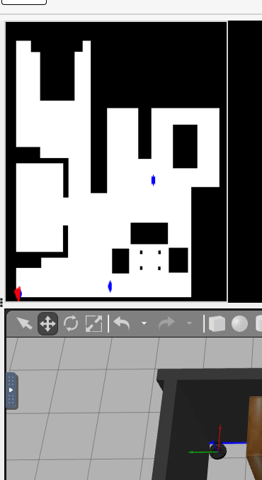
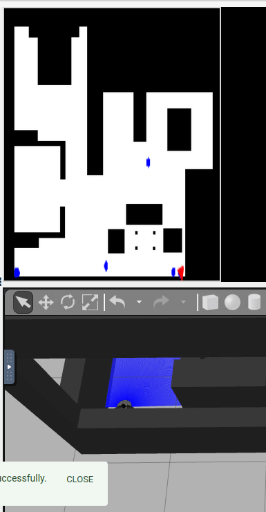
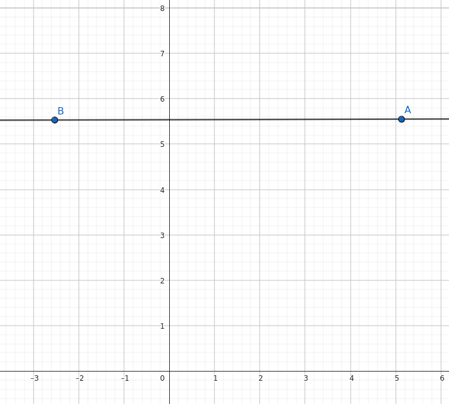
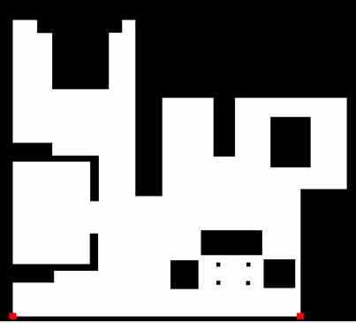
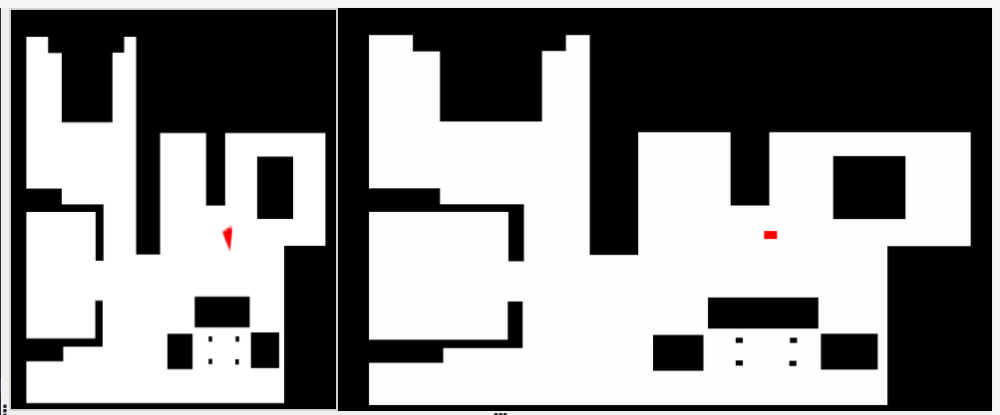

# Measures

## The following maeasures have been obtained


**Left-Bottom corner**:
<div align="center">
    
</div>

```json
Pose3D: {
  x: 5.1316
  y: 5.5555
  z: 0.0009
  yaw: -0.008
  pitch: -0.0007
  roll: -7.742
  ...
}
```

**Right-Bottom corner**:
<div align="center">
    
</div>

```json
Pose3D: {
  x: -2.527
  y: 5.5310
  z: 0.0009
  yaw: -0.013
  pitch: -0.0007
  roll: -8.1314
  ...
}
```


Since we have moved the robot in an horizontal trayectory, we can map the points and infer the rotation of the map inside the robot:

<div align="center">
    
</div>

## The following cells have been obtained at the map-image:

<div align="center">
    
</div>

```python
coordinates_bottom_left = [996, 48]
coordinates_bottom_right = [996, 850]
```

## Position
By using trial-error an approximation of the position of the 0,0 coordinates from the robot according to the image pixels are the following:

```python
X_POSITION = 670
Y_POSITION = 570
```

<div align="center">
    
</div>

# Calculating come properties:

Since when moving horizontally, the points don't move in the y-axis but align in reversed positions (B -> A in the image from previous section), we can infer the rotation of the robot coordinates are:

```bash
ROTATION: 180º
ROTATION = math.pi
```

For computing the scale, we can compare the distance in pixels with the distance in coordinates:

```python
  robot: 5.1316m - (-2.527m) = 7.6586m
  pixels: 850 - 48 = 802pixels

  scale = 802/7.6586 = 104.71
```


# Mental Maths
Let the following expresion:

$[0;0;0]$